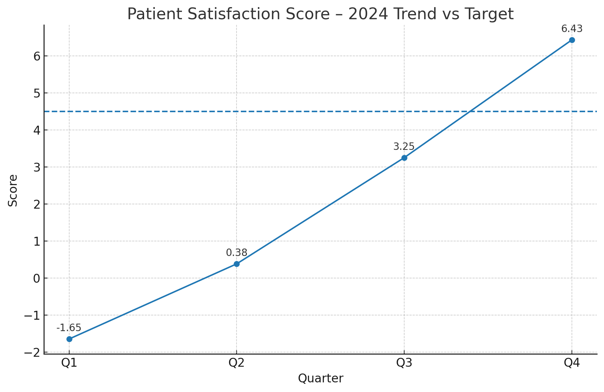
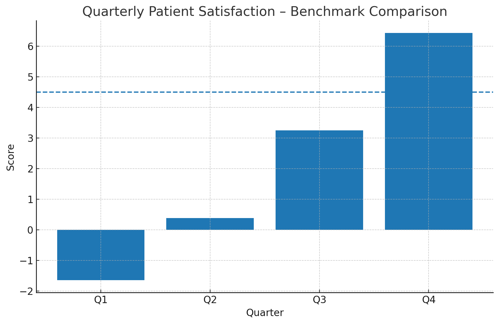

# Healthcare Performance Analysis – Patient Satisfaction (2024)

**Owner:** Senior Data Analyst  
**Email (verification):** 23f1000267@ds.study.iitm.ac.in

## Summary

- **Current Average (2024): `2.1`** (must match exactly)  
- **Industry Target:** `4.5`  
- **Quarterly Scores:** Q1 = -1.65, Q2 = 0.38, Q3 = 3.25, Q4 = 6.43

The organization is underperforming the benchmark of 4.5 in **all quarters**, despite a strong recovery into Q4. The data indicates operational issues early in the year (Q1–Q2), followed by improvements that likely reflect service quality interventions, capacity adjustments, or process stabilization.

## Visualizations




> Run `python analysis.py` to regenerate figures from `data/patient_satisfaction_2024.csv`.

## Key Findings

1. **Average performance is well below target:** The 2024 average is **2.1**, which is **2.4 points** below the 4.5 target.
2. **Severe early-year underperformance:** Q1 (-1.65) and Q2 (0.38) indicate **acute patient dissatisfaction**, consistent with long wait times, staffing gaps, or service breakdowns.
3. **Progress but not enough:** Q3 (3.25) and Q4 (6.43) show **continuous improvement** (QoQ deltas: 0.0, 2.03, 2.87, 3.18), but only **Q4 exceeds** the benchmark on a single-quarter basis while the **annual average** still misses the target.
4. **Volatility implies process instability:** The large swing from **-1.65 (Q1)** to **6.43 (Q4)** suggests **inconsistent service delivery**, triage, or scheduling policies across the year.

## Business Implications

- **Brand & retention risk:** Persistently low satisfaction depresses **repeat visits, word-of-mouth, and payer negotiations**.
- **Operational cost pressure:** Dissatisfied patients often trigger **rework**, longer encounters, and **higher grievance handling** overhead.
- **Regulatory and accreditation risk:** Sustained low PX can affect **quality ratings** and reimbursement-linked metrics.
- **Forecast:** Without structural fixes, the average will remain below 4.5, jeopardizing **next fiscal year** growth assumptions.

## Recommendations — Focus: *Improve service quality and wait times*

### 1) Reduce Wait Times End-to-End
- **Demand shaping & capacity planning:** Align provider hours to arrival patterns; use **overflow clinics** at peak slots.
- **Fast triage lane:** Introduce **nurse-led rapid assessment** for low-acuity cases; set **≤10 min** triage SLA.
- **Digital queue transparency:** Provide **real-time wait estimates** and self-check-in to reduce perceived waits.

### 2) Lift First-Contact Resolution & Experience
- **Scripting & empathy training:** Standardize greeter/triage scripts; weekly **role-play** for front desk and call center.
- **Proactive communication:** Status updates every **15 minutes**; notify delays before threshold breaches.
- **Environment hygiene:** Quiet zones, seating comfort, and **distraction kits** for pediatrics.

### 3) Stabilize Processes (Reduce Volatility)
- **Standard work + audits:** Daily huddles, **visual management boards**, and checklists in high-variability steps.
- **Bottleneck removal:** Map patient flow; elevate **top 3 constraints** (e.g., imaging turnaround, lab draw capacity).
- **Cross-coverage staffing:** Float pool to cover **call-outs** and predictable peaks.

### 4) Measurement & Governance
- **PX scorecard:** Track **median wait**, **left-without-being-seen (LWBS)**, **time-to-triage**, **time-to-provider**, and **Net Promoter** weekly.
- **A/B operational experiments:** Trial **appointment slot lengths** and **arrival smoothing**; publish results monthly.
- **Accountable owner:** COO-led **PX Tiger Team** with 90-day plan; biweekly exec readouts.

## How to Reproduce

```bash
python -m venv .venv
source .venv/bin/activate  # on Windows: .venv\Scripts\activate
pip install -r requirements.txt
python analysis.py
```

## Files in This PR

- `data/patient_satisfaction_2024.csv` – Source data (Q1–Q4, 2024)
- `analysis.py` – Processing and visualization
- `figures/` – Generated charts
- `README.md` – This data story and insights
- `requirements.txt` – Python dependencies

---

*Prepared with LLM-assisted analysis and code generation (ChatGPT).*
